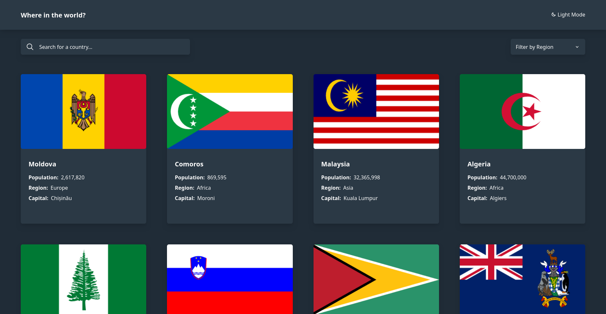
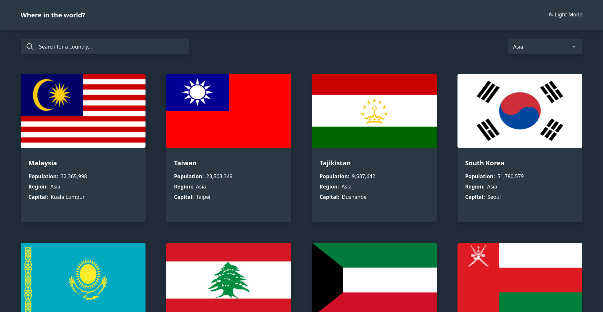
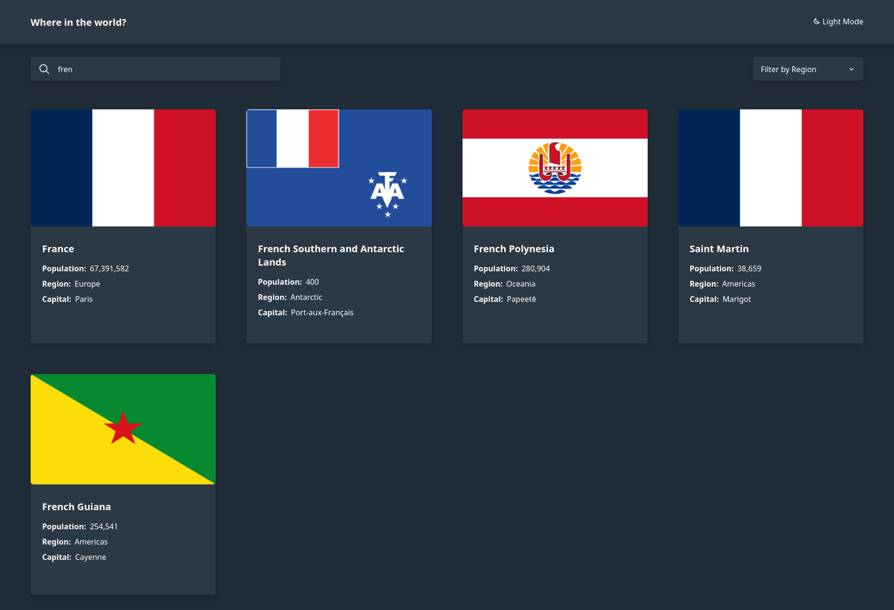

# Frontend Mentor - REST Countries API with color theme switcher solution

This is a solution to the [REST Countries API with color theme switcher challenge on Frontend Mentor](https://www.frontendmentor.io/challenges/rest-countries-api-with-color-theme-switcher-5cacc469fec04111f7b848ca). Frontend Mentor challenges help you improve your coding skills by building realistic projects.

## Table of contents

- [Overview](#overview)
  - [The challenge](#the-challenge)
  - [Screenshot](#screenshot)
  - [Links](#links)
- [My process](#my-process)
  - [Built with](#built-with)
  - [What I learned](#what-i-learned)
  - [Continued development](#continued-development)
  - [Useful resources](#useful-resources)

## Overview

### The challenge

Users should be able to:

- See all countries from the API on the homepage
- Search for a country using an `input` field
- Filter countries by region
- Click on a country to see more detailed information on a separate page
- Click through to the border countries on the detail page
- Toggle the color scheme between light and dark mode

### Screenshot







### Links

- Live Site URL: [Preview](https://azanra.github.io/rest-countries/)

## My process

### Built with

- React
- Fetch Custom Hook with useEffect
- Tailwind

### What I learned

Creating custom hooks to fetch the data with useEffect, inside of the custom hooks, we will have three state, the data, loading, and error. if the fetch is finished, it will return those state.

If we need to fetch the data, we just need to call the custom hooks. since hook must be called at the top of the component. if i need to call the hooks inside condition. loops, etc.., i can extract those into it own component so that i can call the custom hooks inside the exracted component

```js
export function useGetAllCountry() {
  const [country, setCountry] = useState([]);
  const [loading, setLoading] = useState(true);
  const [error, setError] = useState(null);

  const FIELDS = APIFILTER;
  const URL = `https://restcountries.com/v3.1/all?fields=${FIELDS}`;

  useEffect(() => {
    fetch(URL)
      .then((response) => {
        if (!response.ok) {
          throw new Error("Error");
        }
        return response.json();
      })
      .then((response) => {
        setCountry(response);
      })
      .catch((error) => setError(error))
      .finally(() => setLoading(false));
  }, [URL]);

  return { country, loading, error };
}
```

```js
const {
  country: allCountry,
  loading: allLoading,
  error: allError,
} = useGetAllCountry();
```

### Continued development

- Cached the response call
- If the search country result is less than 4, the background will not cover the full screen
- useEffect is really easy to use to be missued, Get more practice with it so that i can know when it is appropriate to use effect.

### Useful resources

- [Odin Fetching Data in React](https://www.theodinproject.com/lessons/node-path-react-new-fetching-data-in-react) - Explained on how to fetch data in react and how to create custom hook for it
- [React You Might Not Need an Effect](https://react.dev/learn/you-might-not-need-an-effect) - For detailed explanation when you shouldn't use effect
